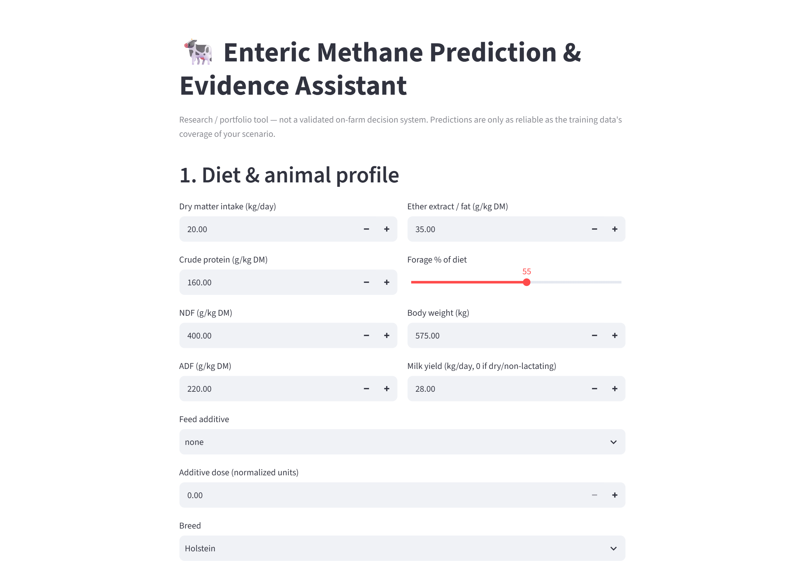
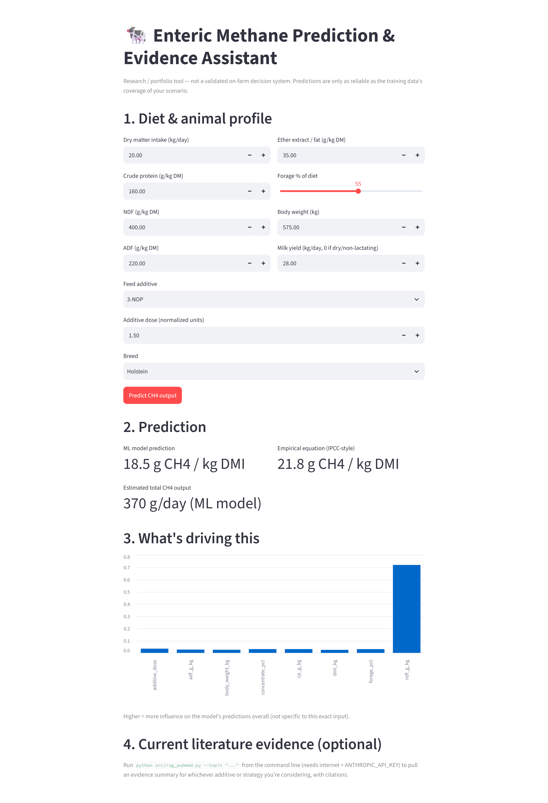

# enteric-methane-ai

> Scientific AI Assistant for Sustainable Ruminant Nutrition — Enteric Methane Prediction, Explainability & Evidence Retrieval

## Project Overview

`enteric-methane-ai` is an applied machine learning and scientific AI project focused on predicting enteric methane (CH4) emissions from ruminant diet composition and animal traits.

The project combines three layers:

1. **Prediction** — machine learning models estimate methane output from diet and animal variables.
2. **Explainability** — feature-importance and SHAP-style interpretation help identify which inputs drive the prediction.
3. **Evidence retrieval** — a lightweight retrieval-augmented generation (RAG) layer connects mitigation suggestions to scientific literature.

This project was built to demonstrate the intersection of **animal nutrition domain expertise**, **machine learning**, **explainable AI**, and **responsible scientific decision support**.

## Why This Project Matters

Enteric methane from ruminant livestock is a major sustainability challenge in animal production. Reducing methane emissions while maintaining animal performance is an important research and industry priority.

Many methane estimation approaches are based on empirical equations or mechanistic models. Modern machine learning can complement these approaches by learning nonlinear relationships between diet composition, animal traits, and methane output. However, prediction alone is not enough for scientific or practical use.

For that reason, this project focuses on three questions:

- **How much methane is predicted for a given diet and animal profile?**
- **Which diet or animal variables are most responsible for the prediction?**
- **What mitigation options are supported by scientific evidence?**

## Demo

The Streamlit app allows the user to enter a diet and animal profile, generate a methane prediction, compare it with a benchmark equation, and inspect the most influential variables.





## Main Features

### 1. Methane Prediction

The modelling layer is designed to estimate enteric methane emissions using structured diet and animal features such as:

- Dry matter intake
- Crude protein
- Neutral detergent fiber
- Ether extract
- Starch
- Forage proportion
- Body weight
- Milk yield
- Diet category or mitigation treatment indicators, where available

The current pipeline supports tree-based regression models such as:

- Random Forest Regressor
- Gradient Boosting Regressor
- XGBoost, if installed

The model outputs can be benchmarked against a published empirical equation implemented in `src/benchmark_equation.py`.

### 2. Explainability and Mitigation Ranking

The explainability layer helps translate model outputs into interpretable insight.

It is designed to generate:

- Global feature importance
- Local prediction drivers for a selected profile
- A ranked mitigation-opportunity table
- Comparison between machine learning predictions and benchmark equation estimates

This is important because methane mitigation is not only a prediction problem. In a practical nutrition context, the user needs to understand which controllable variables may be linked to higher or lower methane output.

### 3. Scientific Evidence Retrieval

The RAG layer is designed to retrieve scientific abstracts related to methane mitigation strategies such as:

- 3-NOP
- Asparagopsis / seaweed additives
- Tannins
- Nitrate
- Dietary fat
- Forage-to-concentrate ratio
- Feed efficiency and intake-related strategies

The purpose is to prevent static or unsupported recommendations. The assistant should cite retrieved evidence and clearly state when the evidence is insufficient.

## Data

This repository is structured around a published enteric methane mitigation dataset:

> **A global dataset of enteric methane mitigation experiments with lactating and non-lactating dairy cows conducted from 1963 to 2022**

The dataset contains records compiled from peer-reviewed methane mitigation studies. The raw dataset is **not included** in this repository. Users should download the open-access dataset from the original publisher or data repository and place it in:

```text
data/raw/
```

To make the project runnable without redistributing the raw dataset, the repository includes a synthetic data generator:

```text
src/generate_synthetic_data.py
```

This script creates a synthetic dataset with similar column names and plausible biological ranges, allowing the full pipeline to be tested end-to-end. The synthetic data is intended for software testing, demonstration, and portfolio reproducibility only. It should not be interpreted as real experimental evidence.

## Repository Structure

```text
enteric-methane-ai/
├── app/
│   └── app.py                         # Streamlit app
├── data/
│   ├── raw/                           # Raw external dataset, not committed
│   ├── processed/                     # Cleaned and model-ready data
│   └── README.md                      # Data notes and provenance
├── images/
│   ├── app_input_form.png             # App screenshot
│   └── app_prediction_results.png     # App screenshot
├── notebooks/
│   └── 01_eda.py                      # Exploratory analysis script/notebook draft
├── src/
│   ├── generate_synthetic_data.py     # Synthetic data generator
│   ├── data_prep.py                   # Cleaning and feature engineering
│   ├── benchmark_equation.py          # Empirical benchmark equation
│   ├── train_models.py                # Model training and evaluation
│   ├── explain.py                     # Explainability and ranking outputs
│   └── rag_pubmed.py                  # PubMed retrieval and evidence summary
├── .gitignore
├── LICENSE
├── README.md
└── requirements.txt
```

## Workflow

The intended project workflow is:

1. Generate or add data
2. Clean and engineer features
3. Train and evaluate models
4. Compare ML predictions with a benchmark equation
5. Generate explainability outputs
6. Retrieve supporting literature for mitigation strategies
7. Use the Streamlit app for interactive prediction and interpretation

## How to Run

### 1. Create and activate an environment

```bash
python -m venv .venv
```

Windows:

```bash
.venv\Scripts\activate
```

macOS/Linux:

```bash
source .venv/bin/activate
```

### 2. Install dependencies

```bash
pip install -r requirements.txt
```

### 3. Generate synthetic data

```bash
python src/generate_synthetic_data.py
```

### 4. Prepare the data

```bash
python src/data_prep.py
```

### 5. Train and evaluate models

```bash
python src/train_models.py
```

### 6. Run explainability analysis

```bash
python src/explain.py
```

### 7. Run the optional evidence-retrieval layer

This step requires internet access and a configured API key if an LLM-based summary is used.

```bash
python src/rag_pubmed.py --topic "3-NOP methane dairy cattle"
```

### 8. Launch the Streamlit app

```bash
streamlit run app/app.py
```

## Example Use Case

A user enters a dairy cow diet profile into the app. The model predicts methane output and compares the result with a benchmark equation. The explainability layer identifies the strongest drivers behind the prediction, such as intake level, fiber content, or diet composition. The evidence-retrieval layer can then retrieve scientific abstracts related to relevant mitigation strategies and summarize the current evidence with citations.

## Responsible AI and Scientific Limitations

This project is intended as a research and portfolio prototype, not a validated on-farm decision system.

Important limitations:

- Model predictions depend on the quality, coverage, and representativeness of the training data.
- Synthetic data is used only to make the pipeline reproducible when the real dataset is not available.
- Predictions may be unreliable for diet or animal profiles outside the training distribution.
- Mitigation recommendations should be interpreted together with animal performance, health, feed cost, and practical farm constraints.
- The RAG layer should cite retrieved sources and clearly indicate when evidence is limited or inconclusive.
- Final decisions should be made by qualified animal nutrition, veterinary, and sustainability professionals.

## Skills Demonstrated

This project demonstrates:

- Applied machine learning for sustainability and animal nutrition
- Regression modelling and model benchmarking
- Data cleaning and feature engineering
- Explainable AI for scientific interpretation
- Retrieval-augmented generation for evidence-grounded recommendations
- Streamlit app development
- Responsible AI framing and limitation handling
- Domain-specific translation of model output into practical insight

## Possible Extensions

Future improvements could include:

- Replacing synthetic data with the full external methane mitigation dataset
- Adding uncertainty estimates or prediction intervals
- Adding out-of-distribution input checks in the app
- Implementing SHAP visualizations inside the Streamlit interface
- Expanding the RAG layer with more structured evidence grading
- Adding a rumen microbiome module if a suitable public dataset is available
- Adding a poultry nutrition track focused on feed efficiency or nitrogen excretion
- Creating a deployable demo version of the Streamlit app

## Portfolio Relevance

This project is especially relevant for roles at the intersection of:

- Data Science
- Machine Learning
- Responsible AI
- Sustainability analytics
- Agri-tech
- Animal nutrition and feed innovation
- Scientific software prototyping

It shows how domain expertise can be combined with modern AI methods to build tools that are not only predictive, but also explainable, evidence-aware, and scientifically responsible.

## Author

**Mahdi Dadgar**  
PhD in Animal Science and Animal Nutrition  
Transitioning into Data Analytics, Business Intelligence, Data Science, Machine Learning, Deep Learning, and AI

GitHub: [mahdidadgar-data](https://github.com/mahdidadgar-data)
